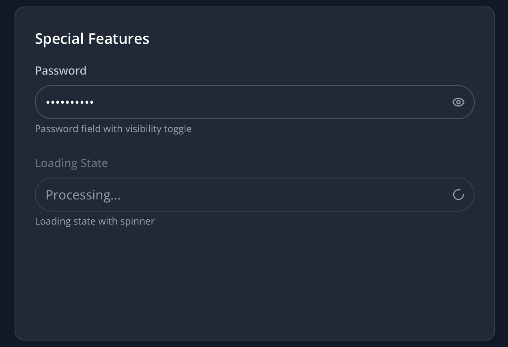

# React TypeScript Component Library

A modern component library built with React, TypeScript, and TailwindCSS.  
It includes two ready-to-use components: **InputField** and **DataTable**.

---

## Screenshots

### InputField Variants

<table>
  <tr>
    <td></td>
    <td></td>
    <td></td>
    <td></td>
  </tr>
</table>

### DataTable Variants

<table>
  <tr>
    <td></td>
    <td></td>
    <td></td>
    <td></td>
  </tr>
</table>

---

## Features

### InputField
- Multiple visual styles: filled, outlined, and ghost  
- Different sizes: small, medium, and large  
- States: disabled, invalid, and loading  
- Extra options: password visibility toggle and clearable input  
- Strong TypeScript support with defined interfaces  
- Accessible with ARIA labels and keyboard navigation  
- Works in both light and dark mode  

### DataTable
- Generic TypeScript support for any data structure  
- Clickable column headers for sorting  
- Single or multi-row selection with callbacks  
- Skeleton loaders for loading states  
- Customizable message for empty states  
- Mobile-friendly with horizontal scrolling  
- Custom cell rendering support  
- Accessible with keyboard navigation and screen reader support  

---

## Tech Stack
- React 18  
- TypeScript  
- TailwindCSS  
- Vite for fast builds  
- Wouter for routing  

---

## Getting Started

```bash
# Clone this repository
git clone <your-repo-url>
cd react-component-library

# Install dependencies
npm install

# Start development server
npm run dev

# Visit http://localhost:5000 to view the demos

Using the Components

InputField

import { InputField } from './components/InputField/InputField';

// Basic example
<InputField 
  label="Email Address"
  placeholder="Enter your email"
  type="email"
/>

// Example with more options

<InputField 
  variant="filled"
  size="lg"
  label="Password"
  type="password"
  clearable
  loading={isValidating}
  helperText="Must be at least 8 characters"
/>

DataTable

import { DataTable } from './components/DataTable/DataTable';

const columns = [
  { key: 'name', header: 'Name', sortable: true },
  { key: 'email', header: 'Email', sortable: true },
  { 
    key: 'status', 
    header: 'Status', 
    render: (value) => <StatusBadge status={value} /> 
  }
];

<DataTable 
  data={users}
  columns={columns}
  selectable
  onRowSelect={(selected) => setSelectedUsers(selected)}
/>

Project Structure

├── client/                 # Frontend application
│   ├── src/
│   │   ├── components/    # Reusable UI components
│   │   │   ├── InputField/
│   │   │   ├── DataTable/
│   │   │   └── ThemeProvider/
│   │   ├── pages/         # Application pages
│   │   └── lib/           # Utility functions
├── server/                # Backend API
└── shared/                # Shared types and schemas

Design Decisions
	•	Components are composable and flexible rather than locked to one configuration
	•	Strong TypeScript types for safety
	•	Accessibility is prioritized (ARIA, WCAG standards)
	•	Built with performance in mind
	•	TailwindCSS for fast styling, with theme variables for light and dark mode
	•	Mobile-first, responsive design

Testing
	•	Unit tests for components
	•	Integration tests for user interactions
	•	Accessibility tests
	•	Visual regression tests

Browser Support

Latest two versions of Chrome, Firefox, Safari, and Edge.

Development Principles
	•	TypeScript-first for safer code
	•	Component-driven development for maintainability
	•	Accessibility-first approach
	•	Responsive design from the start
	•	Performance-optimized React patterns

License

This project is licensed under the MIT License.
